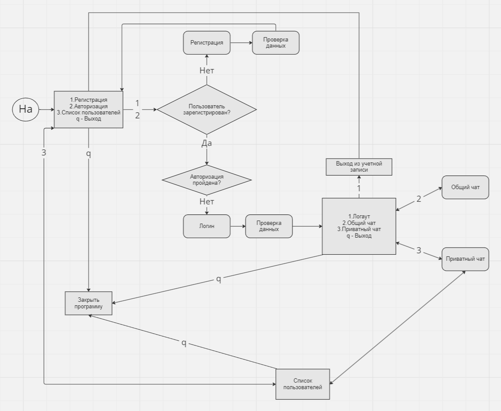

# Консольный чат
Реализация итогового проекта. Чат для консоли включает в себя консольную программу. Возможности:
- регистрация пользователей - логин, пароль, имя
- вход в чат по логину/паролю
- отправка сообщений конкретному пользователю
- обмен сообщениями между всеми пользователями чата одновременно 
# Авторы:
Колесников Дмитрий группа CPLUS_35: отвечает за класс User, работу меню Actions и реализацию механизмов регистрации, логин/логаут, активного пользователя и список пользователей в классе Chat

Коповая Александра группа CPLUS_36: отвечает за класс Massage и реализцаию механизмов ввода/вывода сообщений в общий/приватный чаты и получателя в классе Chat

#Классы
Console_chat.cpp
int actions() // функция, отвечающая за выбор действия в консоли

User //класс описывает пользователя, включает в себя имя, логин и пароль + их редакцию для дальнейшей передачи в Chat

Message //класс описывает создание сообщений и отправку их в чат
void writeMessage() //ввод сообщения с консоли
std::string getMessage() //геттер сообщения
void showMessage() //метод для вывода сообщения и его автора в чат

Chat// класс описывает процессы регистрации, логина, логаута, отправки сообщения и их распределения в общий\приватный чаты
std::string readInput(); //считывает ввод с консоли и возвращает текст типа String
	void userDataInput(User& user); //ввод имени, логина и пароля пользователя4
	void logInInput(User& user); //ввод только логина и пароля, используется для входа в аккаунт 
	void regUser(bool* userExist); // регистрация нового пользователя
	void logInUser(bool* userExist);
	void logOutUser(bool* userExist);
	void isAvailable(User& user, bool& check); // проверяет, заняты ли логин и пароль

	void setActiveUser(bool* userExist, int id, std::string name, std::string login); //задает ID, имя и логин активного пользователя
	bool checkForActiveUser();
	std::string getActiveUserName();
	std::string getActiveUserLogin();
	void setResName(int id, std::string name);
	std::string getActiveResLogin(); //логин получателя
	int getActiveUserID();

	void showUserList(); //отображает список зарегистрированных пользователей
	void addUserToList(User user); //добавляет нового пользователя в список
	size_t listSize();

	void privateChat();
	void generalChat();
	std::string getResipient(int idResipient); // устанавливает получателя сообщения
	void receive_priv_Message();
	void recive_Message();
#Блок-схема

